# 🚀 Guía Completa: Rails + React + Vite - Configuración y Funcionamiento

> Documentación técnica del proyecto Megaplex - Integración de React en Rails usando Vite

**Última actualización:** Enero 2026  
**Stack:** Rails 8.0.2, React 19, Vite 5.4, TypeScript

---

## 📑 Tabla de Contenidos

1. [Visión General](#visión-general)
2. [Arquitectura del Sistema](#arquitectura-del-sistema)
3. [Configuración de Rails](#configuración-de-rails)
4. [Configuración de Vite](#configuración-de-vite)
5. [Configuración de React](#configuración-de-react)
6. [Flujo de Datos](#flujo-de-datos)
7. [Guía Paso a Paso](#guía-paso-a-paso)
8. [Comandos Útiles](#comandos-útiles)
9. [Troubleshooting](#troubleshooting)

---

## 🎯 Visión General

### ¿Qué es esta Arquitectura?

Esta es una **aplicación híbrida** donde:
- **Rails** actúa como API backend (JSON)
- **React** maneja toda la interfaz de usuario (SPA)
- **Vite** compila y sirve el código frontend en desarrollo
- **TypeScript** proporciona type safety en el frontend

### Diferencias con Rails Tradicional

| Rails Tradicional | Rails + React + Vite |
|-------------------|----------------------|
| Vistas en ERB | Componentes React |
| Turbo/Stimulus | React Router |
| Asset Pipeline | Vite |
| Server-Side Rendering | Client-Side Rendering (SPA) |
| Formularios Rails | React Hook Form |

---

## 🏗️ Arquitectura del Sistema

### Diagrama de Componentes

```mermaid
graph TB
    subgraph "Cliente (Navegador)"
        A[index.html.erb] --> B[React App]
        B --> C[React Router]
        C --> D[Componentes/Páginas]
    end
    
    subgraph "Frontend Build"
        E[Vite Dev Server :3036] --> F[Hot Module Replacement]
        F --> B
    end
    
    subgraph "Backend"
        G[Rails Server :3000] --> A
        H[API Controllers] --> I[JSON Responses]
    end
    
    D -->|HTTP Requests| H
    I -->|JSON Data| D
    
    style A fill:#e1f5ff
    style B fill:#61dafb
    style G fill:#cc0000
    style E fill:#646cff
```



### Estructura de Directorios

```
megaplex/
├── app/
│   ├── controllers/
│   │   ├── api/                    # ← API Controllers (JSON)
│   │   │   ├── products_controller.rb
│   │   │   └── clients_controller.rb
│   │   └── pages_controller.rb     # ← Sirve HTML base para React
│   │
│   ├── frontend/                   # ← Todo el código React
│   │   ├── entrypoints/           
│   │   │   ├── application.tsx     # ← Entry point de React
│   │   │   └── application.css     # ← Estilos globales
│   │   │
│   │   ├── src/                    # ← Código fuente React
│   │   │   ├── app.tsx            # ← Componente raíz
│   │   │   ├── components/        # ← Componentes reutilizables
│   │   │   ├── pages/             # ← Páginas/vistas
│   │   │   ├── hooks/             # ← Custom hooks
│   │   │   ├── interfaces/        # ← TypeScript types
│   │   │   └── layout/            # ← Layouts (Navbar, etc)
│   │   │
│   │   └── api/                    # ← API clients auto-generados
│   │       └── Api/
│   │           ├── ProductsApi.js
│   │           └── ClientsApi.js
│   │
│   ├── models/                     # ← Models de Rails
│   └── views/
│       ├── layouts/
│       │   └── application.html.erb # ← Layout que carga React
│       └── pages/
│           └── index.html.erb      # ← <div id="root"></div>
│
├── config/
│   ├── routes.rb                   # ← Rutas Rails + API
│   ├── vite.json                   # ← Config Vite Rails
│   └── database.yml
│
├── public/
│   └── vite/                       # ← Assets compilados (producción)
│
├── vite.config.ts                  # ← Configuración de Vite
├── tsconfig.json                   # ← Configuración TypeScript
├── tailwind.config.js              # ← Configuración Tailwind
├── package.json                    # ← Dependencias Node.js
├── Gemfile                         # ← Dependencias Ruby
└── Procfile.dev                    # ← Configuración de procesos dev
```

---

## ⚙️ Configuración de Rails

### 1. Gemfile - Dependencias Ruby

```ruby
# Gemfile
source "https://rubygems.org"

gem "rails", "~> 8.0.2"
gem "pg", "~> 1.1"                # PostgreSQL
gem "puma", ">= 5.0"              # Web server

# Frontend
gem "vite_rails"                  # ← Integración Vite con Rails

# Generación automática de API clients
gem "js_from_routes"              # ← Genera código JS desde routes.rb

# ... otras gemas
```

**¿Qué hace cada gema?**

- **`vite_rails`**: Integra Vite con Rails, proporciona helpers ERB como `vite_javascript_tag`
- **`js_from_routes`**: Lee `routes.rb` y genera código JavaScript/TypeScript con las rutas de la API

### 2. config/routes.rb - Rutas

```ruby
# config/routes.rb
Rails.application.routes.draw do
  root "pages#index"
  
  # ========================================
  # Rutas Frontend (todas van a pages#index)
  # ========================================
  # Necesario para React Router funcione con URLs directas
  get "/products" => "pages#index"
  get "/products/new" => "pages#index"
  get "/products/:id" => "pages#index"
  get "/clients" => "pages#index"
  get "/clients/new" => "pages#index"
  get "/clients/:id" => "pages#index"
  get "/gifs" => "pages#index"
  
  # ========================================
  # API Routes (JSON responses)
  # ========================================
  namespace :api do
    resources :products, export: true  # ← export: true genera JS API client
    resources :clients, export: true
  end
end
```

**Conceptos clave:**

1. **Todas las rutas frontend → `pages#index`**: Esto permite que React Router maneje la navegación del lado del cliente
2. **`namespace :api`**: Agrupa endpoints de API bajo `/api/*`
3. **`export: true`**: Indica a `js_from_routes` que genere código JS para estas rutas

### 3. app/controllers/pages_controller.rb

```ruby
class PagesController < ApplicationController
  def index
    # Solo renderiza la vista HTML base
    # React se encarga del resto
  end
end
```

Este controlador es minimalista porque solo sirve el HTML inicial donde React se monta.

### 4. app/controllers/api/products_controller.rb

```ruby
module Api
  class ProductsController < ApplicationController
    # ========================================
    # Este controlador solo devuelve JSON
    # ========================================
    
    def index
      @products = Product.all
      render json: @products
    end

    def create
      @product = Product.new(product_params)
      if @product.save
        render json: @product, status: :created
      else
        render json: @product.errors, status: :unprocessable_entity
      end
    end

    def show
      @product = Product.find(params[:id])
      render json: @product
    end

    def update
      @product = Product.find(params[:id])
      if @product.update(product_params)
        render json: @product
      else
        render json: @product.errors, status: :unprocessable_entity
      end
    end

    def destroy
      @product = Product.find(params[:id])
      @product.destroy
      head :no_content
    end

    private

    def product_params
      params.require(:product).permit(:name, :description, :public_price, :client_price)
    end
  end
end
```

**Patrones importantes:**

- **Solo JSON**: Usa `render json:` en todos los métodos
- **Status codes HTTP**: `:created`, `:unprocessable_entity`, `:no_content`
- **Strong parameters**: `product_params` whitelist de atributos

### 5. app/views/layouts/application.html.erb

```erb
<!DOCTYPE html>
<html>
  <head>
    <title>Megaplex</title>
    <meta name="viewport" content="width=device-width,initial-scale=1">
    <%= csrf_meta_tags %>
    <%= csp_meta_tag %>
    
    <!-- ============================================ -->
    <!-- VITE TAGS - Cargan el código React           -->
    <!-- ============================================ -->
    <%= vite_client_tag %>
    <%= vite_javascript_tag 'application.tsx' %>
    <%= vite_stylesheet_tag 'application' %>
    
    <!-- Estilos de Rails (si existen) -->
    <%= stylesheet_link_tag :app, "data-turbo-track": "reload" %>
  </head>

  <body>
    <%= yield %>
  </body>
</html>
```

**Helpers de Vite Rails:**

- **`vite_client_tag`**: Conecta con el dev server de Vite (solo en desarrollo)
- **`vite_javascript_tag 'application.tsx'`**: Carga el entrypoint de React
- **`vite_stylesheet_tag 'application'`**: Carga los estilos CSS

### 6. app/views/pages/index.html.erb

```erb
<div id="root">2222</div>
```

**Simple pero crítico:**

- **`id="root"`**: Elemento DOM donde React se monta
- El texto "2222" se reemplaza cuando React inicia
- Si ves "2222", significa que React no se cargó correctamente

### 7. config/vite.json

```json
{
  "all": {
    "sourceCodeDir": "app/frontend",
    "watchAdditionalPaths": []
  },
  "development": {
    "autoBuild": true,
    "publicOutputDir": "vite-dev",
    "port": 3036
  },
  "test": {
    "autoBuild": true,
    "publicOutputDir": "vite-test",
    "port": 3037
  }
}
```

**Configuración:**

- **`sourceCodeDir`**: Dónde está el código frontend
- **`port: 3036`**: Puerto del dev server de Vite
- **`publicOutputDir`**: Carpeta donde se compilan assets

---

## 🔧 Configuración de Vite

### vite.config.ts

```typescript
import { defineConfig } from 'vite'
import { resolve } from 'path'
import ViteRails from 'vite-plugin-rails'
import tailwindcss from '@tailwindcss/vite'

export default defineConfig({
  plugins: [
    ViteRails(),              // ← Plugin para integración con Rails
    tailwindcss({             // ← Plugin de Tailwind CSS
      config: './tailwind.config.js'
    }),
  ],
  
  resolve: {
    alias: {
      '@': resolve(__dirname, './app/frontend/src')  // ← Alias @/ para imports
    }
  },
  
  root: './app/frontend',                 // ← Directorio raíz del frontend
  publicDir: 'public',
  
  build: {
    outDir: '../../public/vite',          // ← Salida de build de producción
    emptyOutDir: true,
    manifest: true,                       // ← Genera manifest.json
    rollupOptions: {
      input: 'app/frontend/entrypoints/application.tsx'  // ← Entry point
    }
  }
})
```

**Conceptos clave:**

1. **ViteRails()**: Plugin que conecta Vite con Rails
2. **Alias `@/`**: Permite imports como `import { Navbar } from '@/layout/navbar'`
3. **root**: Le dice a Vite dónde buscar archivos
4. **build.outDir**: En producción, compila a `public/vite/`
5. **manifest**: Necesario para que Rails sepa qué archivos cargar en producción

### package.json

```json
{
  "private": true,
  "type": "module",
  
  "devDependencies": {
    "@tailwindcss/vite": "^4.1.12",
    "@types/node": "^24.3.0",
    "@types/rails__request.js": "^0.0.1",
    "@types/react": "^19.1.10",
    "react": "^19.1.1",
    "react-dom": "^19.1.1",
    "tailwindcss": "^4.1.12",
    "vite": "^5.4.19",
    "vite-plugin-full-reload": "^1.2.0",
    "vite-plugin-ruby": "^5.1.1"
  },
  
  "dependencies": {
    "@js-from-routes/client": "^1.0.4",    // ← Cliente para rutas generadas
    "@rails/request.js": "^0.0.12",        // ← Para requests con CSRF
    "@tanstack/react-query": "^5.85.3",    // ← Data fetching
    "@vitejs/plugin-react": "^5.0.0",      // ← Plugin React para Vite
    "react-hook-form": "^7.62.0",          // ← Formularios
    "react-router-dom": "^7.8.0",          // ← Routing
    "vite-plugin-rails": "^0.5.0"
  }
}
```

**Dependencias importantes:**

- **`vite-plugin-rails`**: Conecta Vite con Rails
- **`@vitejs/plugin-react`**: Habilita JSX/TSX en Vite
- **`@tanstack/react-query`**: Manejo de estado del servidor (cache, refetch, etc)
- **`react-router-dom`**: Navegación del lado del cliente

---

## ⚛️ Configuración de React

### 1. app/frontend/entrypoints/application.tsx

```typescript
import React from 'react';
import App from '../src/app';
import { createRoot } from 'react-dom/client';

// ========================================
// Entry Point - Monta React en el DOM
// ========================================

const rootElement = document.getElementById('root');

if (rootElement) {
  const root = createRoot(rootElement);
  root.render(<App />);
}
```

**Flujo:**

1. Busca el elemento `<div id="root">`
2. Crea un root de React 19
3. Renderiza el componente `<App />`

### 2. app/frontend/src/app.tsx

```typescript
import React from "react";
import { QueryClient, QueryClientProvider } from "@tanstack/react-query";
import { BrowserRouter, Routes, Route } from "react-router-dom";
import { Navbar } from "./layout/navbar";
import { Content } from "./components/content";
import { Products } from "./pages/products";
import { CreateProduct } from "./pages/products/new";
import { EditProduct } from "./pages/products/edit";
import { Clients } from "./pages/clients";
import { CreateClient } from "./pages/clients/new";
import { EditClient } from "./pages/clients/edit";
import { Gifs } from "@/pages/gifs/index.js";

// ========================================
// Query Client - TanStack Query
// ========================================
const queryClient = new QueryClient({
  defaultOptions: {
    queries: {
      staleTime: 1000 * 60 * 5,  // 5 minutos
      retry: 1,
    },
  },
});

export const App = () => {
  return (
    <QueryClientProvider client={queryClient}>
      <BrowserRouter>
        <Routes>
          {/* Layout wrapper con Navbar */}
          <Route path="/" element={<Navbar />}>
            <Route index element={<Content />} />
            
            {/* Rutas de Products */}
            <Route path="/products" element={<Products />} />
            <Route path="/products/new" element={<CreateProduct />} />
            <Route path="/products/:id" element={<EditProduct />} />
            
            {/* Rutas de Clients */}
            <Route path="/clients" element={<Clients />} />
            <Route path="/clients/new" element={<CreateClient />} />
            <Route path="/clients/:id" element={<EditClient />} />
            
            {/* Rutas de Gifs */}
            <Route path="/gifs" element={<Gifs />} />
          </Route>
        </Routes>
      </BrowserRouter>
    </QueryClientProvider>
  );
}

export default App;
```

**Componentes clave:**

1. **`QueryClientProvider`**: Envuelve la app para usar TanStack Query
2. **`BrowserRouter`**: Habilita routing del lado del cliente
3. **Layout pattern**: `<Navbar />` es el layout padre con `<Outlet />`
4. **Rutas anidadas**: Coinciden con las rutas en `routes.rb`

### 3. app/frontend/src/hooks/useProducts.ts

```typescript
import { useQuery } from "@tanstack/react-query";

type Product = {
  id: number;
  name: string;
  description: string;
  public_price: number;
  client_price: number;
};

export function useProducts() {
  return useQuery<Product[]>({
    queryKey: ['products'],
    queryFn: () => fetch('/api/products').then(res => res.json()),
  });
}
```

**Patrón de datos:**

- Custom hook para cada recurso
- `queryKey`: Identificador único para cache
- `queryFn`: Función que hace el fetch
- Retorna: `{ data, isLoading, error, refetch }`

### 4. app/frontend/api/Api/ProductsApi.js (Auto-generado)

```javascript
// DO NOT MODIFY: This file was automatically generated by JsFromRoutes.
import { definePathHelper } from '@js-from-routes/client'

export default {
  index: definePathHelper('get', '/api/products'),
  create: definePathHelper('post', '/api/products'),
  new: definePathHelper('get', '/api/products/new'),
  edit: definePathHelper('get', '/api/products/:id/edit'),
  show: definePathHelper('get', '/api/products/:id'),
  update: definePathHelper('patch', '/api/products/:id'),
  destroy: definePathHelper('delete', '/api/products/:id'),
}
```

**Uso:**

```typescript
import ProductsApi from '@/api/Api/ProductsApi'

// Obtener todos los productos
const response = await ProductsApi.index()

// Obtener un producto específico
const response = await ProductsApi.show({ id: 5 })

// Actualizar un producto
const response = await ProductsApi.update({ id: 5, product: { name: 'Nuevo nombre' } })
```

### 5. tsconfig.json

```json
{
  "compilerOptions": {
    "target": "ESNext",
    "lib": ["DOM", "DOM.Iterable", "ESNext"],
    "jsx": "react-jsx",
    "module": "ESNext",
    "moduleResolution": "Node16",
    
    // Type checking
    "strict": true,
    "skipLibCheck": true,
    "esModuleInterop": true,
    "allowSyntheticDefaultImports": true,
    "forceConsistentCasingInFileNames": true,
    
    // Imports
    "resolveJsonModule": true,
    "isolatedModules": true,
    "noEmit": true,
    
    // Path mapping
    "baseUrl": ".",
    "paths": {
      "@/*": ["./app/frontend/src/*"]
    }
  },
  "include": ["app/frontend/src/**/*"],
  "exclude": ["node_modules"]
}
```

**Configuraciones importantes:**

- **`jsx: "react-jsx"`**: Usa React 19 JSX transform
- **`paths`**: Define alias `@/` para imports
- **`strict: true`**: Habilita type checking estricto

---

## 🔄 Flujo de Datos

### Flujo Completo: Request → Response


### Ejemplo Práctico: Crear un Producto

**1. Usuario llena formulario en React**

```tsx
// app/frontend/src/pages/products/new.tsx
import { useForm } from 'react-hook-form'

export const CreateProduct = () => {
  const { register, handleSubmit } = useForm()
  
  const onSubmit = async (data) => {
    const response = await fetch('/api/products', {
      method: 'POST',
      headers: { 'Content-Type': 'application/json' },
      body: JSON.stringify({ product: data })
    })
    
    if (response.ok) {
      // Navegar a lista de productos
    }
  }
  
  return (
    <form onSubmit={handleSubmit(onSubmit)}>
      <input {...register('name')} />
      <input {...register('description')} />
      <button type="submit">Crear</button>
    </form>
  )
}
```

**2. Request llega a Rails**

```ruby
# app/controllers/api/products_controller.rb
def create
  @product = Product.new(product_params)
  
  if @product.save
    render json: @product, status: :created
  else
    render json: @product.errors, status: :unprocessable_entity
  end
end
```

**3. Rails guarda en DB y retorna JSON**

```json
// Response 201 Created
{
  "id": 42,
  "name": "Producto Nuevo",
  "description": "Descripción",
  "public_price": 100,
  "client_price": 80,
  "created_at": "2026-01-28T15:00:00Z",
  "updated_at": "2026-01-28T15:00:00Z"
}
```

**4. React procesa la respuesta**

```typescript
if (response.ok) {
  const product = await response.json()
  queryClient.invalidateQueries(['products'])  // Refresca lista
  navigate('/products')
}
```

---

## 📝 Guía Paso a Paso: Desde Cero

### Paso 1: Crear Nueva App Rails

```bash
# Crear proyecto Rails
rails new megaplex --database=postgresql

cd megaplex
```

### Paso 2: Instalar Vite Rails

```bash
# Agregar gem al Gemfile
bundle add vite_rails

# Instalar Vite
bundle exec vite install

# Esto crea:
# - config/vite.json
# - vite.config.ts
# - app/frontend/
```

### Paso 3: Instalar React y Dependencias

```bash
# Inicializar package.json si no existe
npm init -y

# Instalar React
npm install react react-dom

# Instalar tipos de TypeScript
npm install -D @types/react @types/react-dom @types/node

# Instalar plugin de React para Vite
npm install -D @vitejs/plugin-react

# Instalar routing
npm install react-router-dom

# Instalar TanStack Query
npm install @tanstack/react-query

# Instalar Tailwind
npm install -D tailwindcss @tailwindcss/vite

# Instalar js_from_routes
bundle add js_from_routes
npm install @js-from-routes/client
```

### Paso 4: Configurar Vite

```typescript
// vite.config.ts
import { defineConfig } from 'vite'
import { resolve } from 'path'
import ViteRails from 'vite-plugin-rails'
import react from '@vitejs/plugin-react'
import tailwindcss from '@tailwindcss/vite'

export default defineConfig({
  plugins: [
    ViteRails(),
    react(),
    tailwindcss(),
  ],
  resolve: {
    alias: {
      '@': resolve(__dirname, './app/frontend/src')
    }
  },
  root: './app/frontend',
  build: {
    outDir: '../../public/vite',
    emptyOutDir: true,
    manifest: true,
    rollupOptions: {
      input: 'app/frontend/entrypoints/application.tsx'
    }
  }
})
```

### Paso 5: Configurar TypeScript

```json
// tsconfig.json
{
  "compilerOptions": {
    "target": "ESNext",
    "lib": ["DOM", "DOM.Iterable", "ESNext"],
    "jsx": "react-jsx",
    "module": "ESNext",
    "moduleResolution": "Node16",
    "strict": true,
    "esModuleInterop": true,
    "skipLibCheck": true,
    "baseUrl": ".",
    "paths": {
      "@/*": ["./app/frontend/src/*"]
    }
  },
  "include": ["app/frontend/src/**/*"]
}
```

### Paso 6: Crear Estructura de Archivos React

```bash
# Crear directorios
mkdir -p app/frontend/entrypoints
mkdir -p app/frontend/src/{components,pages,hooks,interfaces,layout}
```

```typescript
// app/frontend/entrypoints/application.tsx
import React from 'react'
import { createRoot } from 'react-dom/client'
import App from '../src/app'

const rootElement = document.getElementById('root')
if (rootElement) {
  createRoot(rootElement).render(<App />)
}
```

```typescript
// app/frontend/src/app.tsx
import React from 'react'
import { BrowserRouter, Routes, Route } from 'react-router-dom'

const App = () => {
  return (
    <BrowserRouter>
      <Routes>
        <Route path="/" element={<h1>¡Hola desde React!</h1>} />
      </Routes>
    </BrowserRouter>
  )
}

export default App
```

### Paso 7: Configurar Rails

```ruby
# app/controllers/pages_controller.rb
class PagesController < ApplicationController
  def index
  end
end
```

```erb
<!-- app/views/layouts/application.html.erb -->
<!DOCTYPE html>
<html>
  <head>
    <title>Megaplex</title>
    <%= csrf_meta_tags %>
    <%= csp_meta_tag %>
    <%= vite_client_tag %>
    <%= vite_javascript_tag 'application.tsx' %>
    <%= vite_stylesheet_tag 'application' %>
  </head>
  <body>
    <%= yield %>
  </body>
</html>
```

```erb
<!-- app/views/pages/index.html.erb -->
<div id="root"></div>
```

```ruby
# config/routes.rb
Rails.application.routes.draw do
  root "pages#index"
end
```

### Paso 8: Configurar Procfile.dev

```yaml
# Procfile.dev
vite: bin/vite dev
web: bin/rails s
```

### Paso 9: Crear Primera API

```bash
# Generar modelo
rails g model Product name:string description:text public_price:decimal client_price:decimal

# Migrar base de datos
rails db:create db:migrate

# Generar controlador API
rails g controller api/products --skip-template-engine
```

```ruby
# app/controllers/api/products_controller.rb
module Api
  class ProductsController < ApplicationController
    def index
      render json: Product.all
    end
  end
end
```

```ruby
# config/routes.rb
Rails.application.routes.draw do
  root "pages#index"
  
  namespace :api do
    resources :products, export: true
  end
end
```

### Paso 10: Crear Hook de React para la API

```typescript
// app/frontend/src/hooks/useProducts.ts
import { useQuery } from '@tanstack/react-query'

type Product = {
  id: number
  name: string
  description: string
  public_price: number
  client_price: number
}

export function useProducts() {
  return useQuery<Product[]>({
    queryKey: ['products'],
    queryFn: () => fetch('/api/products').then(res => res.json()),
  })
}
```

### Paso 11: Usar Hook en Componente

```typescript
// app/frontend/src/pages/products/index.tsx
import React from 'react'
import { useProducts } from '@/hooks/useProducts'

export const Products = () => {
  const { data: products, isLoading, error } = useProducts()
  
  if (isLoading) return <div>Cargando...</div>
  if (error) return <div>Error: {error.message}</div>
  
  return (
    <div>
      <h1>Productos</h1>
      <ul>
        {products?.map(product => (
          <li key={product.id}>{product.name}</li>
        ))}
      </ul>
    </div>
  )
}
```

### Paso 12: Agregar Ruta en React Router

```typescript
// app/frontend/src/app.tsx
import { Products } from './pages/products'

const App = () => {
  return (
    <BrowserRouter>
      <Routes>
        <Route path="/" element={<h1>Home</h1>} />
        <Route path="/products" element={<Products />} />
      </Routes>
    </BrowserRouter>
  )
}
```

### Paso 13: Agregar Ruta en Rails

```ruby
# config/routes.rb
Rails.application.routes.draw do
  root "pages#index"
  
  # Ruta para React Router
  get "/products" => "pages#index"
  
  # API
  namespace :api do
    resources :products, export: true
  end
end
```

### Paso 14: Generar Rutas JavaScript

```bash
# Ejecutar una vez para generar archivos en app/frontend/api/
bundle exec rake js_from_routes:generate
```

### Paso 15: Iniciar Servidor de Desarrollo

```bash
# Opción 1: Con foreman (recomendado)
gem install foreman
foreman start -f Procfile.dev

# Opción 2: Dos terminales separadas
# Terminal 1:
rails s

# Terminal 2:
bin/vite dev
```

Visita: `http://localhost:3000`

---

## 💻 Comandos Útiles

### Desarrollo

```bash
# Iniciar ambos servidores
foreman start -f Procfile.dev

# Solo Rails
rails s

# Solo Vite
bin/vite dev

# Generar API clients de js_from_routes
bundle exec rake js_from_routes:generate

# Consola de Rails
rails c

# Ver rutas
rails routes

# Ver rutas de API
rails routes | grep api
```

### Base de Datos

```bash
# Crear base de datos
rails db:create

# Ejecutar migraciones
rails db:migrate

# Revertir última migración
rails db:rollback

# Resetear base de datos
rails db:reset

# Ver estado de migraciones
rails db:migrate:status
```

### Frontend

```bash
# Instalar dependencias
npm install

# Agregar dependencia
npm install nombre-paquete

# Compilar para producción
bin/vite build

# Limpiar assets compilados
bin/vite clobber
```

### Producción

```bash
# Pre-compilar assets
rails assets:precompile

# Build de Vite
bin/vite build

# Iniciar servidor de producción
RAILS_ENV=production rails s
```

---

## 🐛 Troubleshooting

### Problema: "Cannot GET /productos" (404)

**Causa:** Falta agregar la ruta en `routes.rb`

**Solución:**
```ruby
# config/routes.rb
get "/productos" => "pages#index"
```

### Problema: La app muestra "2222" en vez del contenido React

**Diagnóstico:**
1. React no se está cargando
2. Error de JavaScript en consola

**Soluciones:**
```bash
# 1. Verificar que Vite esté corriendo
bin/vite dev

# 2. Verificar consola del navegador
# Abrir DevTools → Console → Ver errores

# 3. Verificar que el archivo existe
ls app/frontend/entrypoints/application.tsx

# 4. Verificar sintaxis del archivo
```

### Problema: Error CORS en requests API

**Causa:** CSRF protection de Rails

**Solución:**
```typescript
// Usar @rails/request.js en vez de fetch
import { get, post } from '@rails/request.js'

const response = await post('/api/products', {
  body: { product: data }
})
```

### Problema: `Cannot find module '@/...'`

**Causa:** Alias no configurado

**Verificar:**
```typescript
// vite.config.ts
resolve: {
  alias: {
    '@': resolve(__dirname, './app/frontend/src')
  }
}

// tsconfig.json
"paths": {
  "@/*": ["./app/frontend/src/*"]
}
```

### Problema: "Vite manifest not found"

**Causa:** Assets no compilados en producción

**Solución:**
```bash
# Compilar assets
bin/vite build

# Verificar que exista
ls public/vite/.vite/manifest.json
```

### Problema: Cambios en React no se reflejan

**Soluciones:**
```bash
# 1. Verificar HMR en consola
# Debería decir: "[vite] connected"

# 2. Hard refresh del navegador
# Ctrl + Shift + R (Windows/Linux)
# Cmd + Shift + R (Mac)

# 3. Reiniciar Vite
# Detener y volver a ejecutar bin/vite dev

# 4. Limpiar cache
bin/vite clobber
```

---

## 📚 Recursos Adicionales

### Documentación Oficial

- [Rails Guides](https://guides.rubyonrails.org/)
- [Vite Rails](https://vite-ruby.netlify.app/)
- [React Documentation](https://react.dev/)
- [TanStack Query](https://tanstack.com/query/latest)
- [React Router](https://reactrouter.com/)

### Gemas Útiles

- [vite_rails](https://github.com/ElMassimo/vite_ruby)
- [js_from_routes](https://github.com/ElMassimo/js_from_routes)

### Herramientas de Desarrollo

- [React DevTools](https://react.dev/learn/react-developer-tools)
- [TanStack Query DevTools](https://tanstack.com/query/latest/docs/react/devtools)

---

## ✅ Checklist de Configuración

Usa esto para verificar que todo esté correctamente configurado:

### Rails
- [ ] Gemfile tiene `vite_rails`
- [ ] Gemfile tiene `js_from_routes` (opcional)
- [ ] `config/vite.json` existe
- [ ] `routes.rb` tiene rutas de API con `namespace :api`
- [ ] `routes.rb` tiene rutas frontend apuntando a `pages#index`
- [ ] `application.html.erb` tiene `vite_client_tag` y `vite_javascript_tag`
- [ ] `pages/index.html.erb` tiene `<div id="root"></div>`

### Vite
- [ ] `vite.config.ts` existe y está configurado
- [ ] `vite.config.ts` tiene plugin `ViteRails()`
- [ ] `vite.config.ts` tiene plugin `react()`
- [ ] `package.json` tiene `react`, `react-dom`, `@vitejs/plugin-react`

### React
- [ ] `app/frontend/entrypoints/application.tsx` existe
- [ ] `app/frontend/src/app.tsx` existe
- [ ] `tsconfig.json` existe y tiene alias `@/*`
- [ ] Estructura de carpetas creada (`components`, `pages`, `hooks`, etc)

### Ejecución
- [ ] Base de datos creada (`rails db:create`)
- [ ] Migraciones ejecutadas (`rails db:migrate`)
- [ ] Dependencias de Node instaladas (`npm install`)
- [ ] Dependencias de Ruby instaladas (`bundle install`)
- [ ] Ambos servidores corriendo (Rails + Vite)
- [ ] Navegador carga la app correctamente

---

## 🎓 Conclusión

Esta arquitectura te permite:

✅ **Desarrollar con React modern** (hooks, TypeScript, routing)  
✅ **Usar Rails como API robusta** (ActiveRecord, validaciones, background jobs)  
✅ **Hot Module Replacement instantáneo** (Vite)  
✅ **Type safety** (TypeScript en frontend)  
✅ **State management simple** (TanStack Query)  
✅ **Separación de concerns** (Frontend/Backend)

Es ideal para:
- 🎯 Dashboards y aplicaciones internas
- 🎯 Apps donde no es prioritario SEO
- 🎯 Equipos que conocen Rails y React
- 🎯 Proyectos que priorizan DX (Developer Experience)

No es ideal para:
- ❌ Blogs o sitios con SEO crítico (usa Hotwire o Inertia.js)
- ❌ Landing pages públicas
- ❌ Apps que necesitan SSR (usa Next.js + Rails API)

---

**¿Preguntas? ¿Quieres agregar algo a este documento?** 🚀
